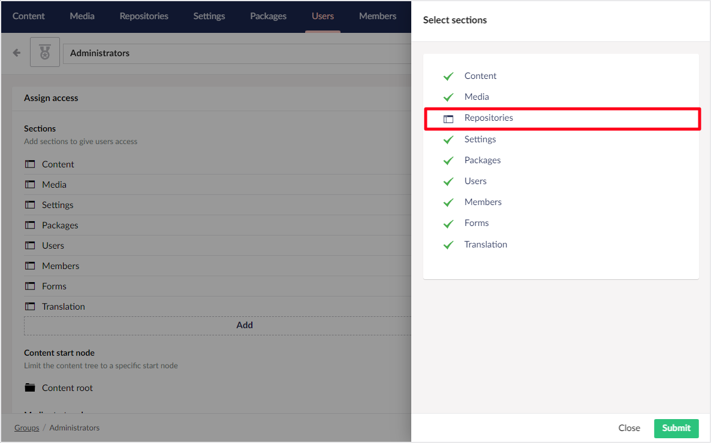
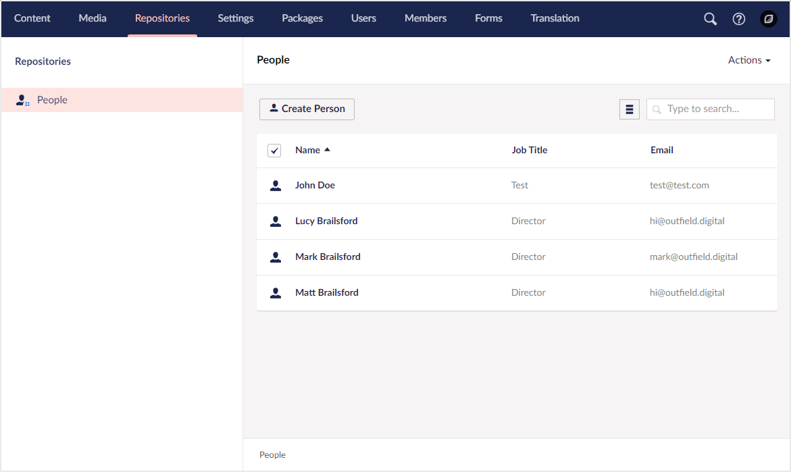
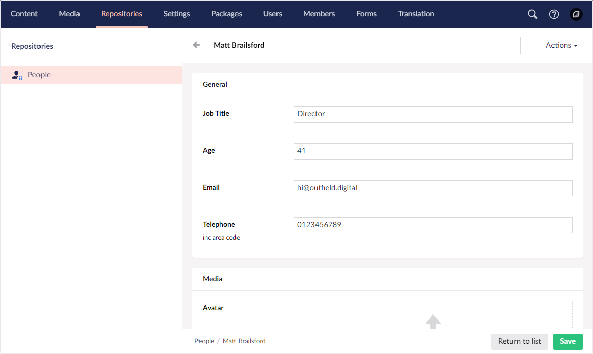

# Creating your first integration

In this guide we'll take you through the steps needed for a basic implementation using Konstrukt to manage a single custom database table.

## Set up the database

Out of the box Konstrukt works using PetaPoco as the persistence layer as this is what ships with Umbraco. It is possible to use a custom [Repository](../api/repositories.md) if you prefer, but for the sake of getting started, we’ll assume you are using this default strategy.

Start by setting up a database table for your model (you might want to populate it with some dummy data as well whilst learning). We’ll use the following as an example:

```sql
CREATE TABLE [Person] (
    [Id] int IDENTITY (1,1) NOT NULL, 
    [Name] nvarchar(255) NOT NULL, 
    [JobTitle] nvarchar(255) NOT NULL, 
    [Email] nvarchar(255) NOT NULL, 
    [Telephone] nvarchar(255) NOT NULL, 
    [Age] int NOT NULL, 
    [Avatar] nvarchar(255) NOT NULL
);
```

## Set up your model

With the database table setup we then need to create the associated poco model in our project.

```csharp
[TableName("Person")]
[PrimaryKey("Id")]
public class Person
{
    [PrimaryKeyColumn]
    public int Id { get; set; }
    public string Name { get; set; }
    public string JobTitle { get; set; }
    public string Email { get; set; }
    public string Telephone { get; set; }
    public int Age { get; set; }
    public string Avatar { get; set; }
}
```

## Configure Konstrukt

With the database and model setup, we can now start to configure Konstrukt itself. The entry point for a Konstrukt configuration is via the `AddKonstrukt` extension method that we call on the `IUmbracoBuilder` instance within the `ConfigureServices` method of the `Startup` class.

```csharp
public class Startup
{
    ...
    public void ConfigureServices(IServiceCollection services)
    {
        services.AddUmbraco(_env, _config)
            .AddBackOffice()
            .AddWebsite()
            .AddKonstrukt(cfg => {
                // Apply your configuration here
            })
            .AddComposers()
            .Build();
    }
    ...
}
```

For our example, we will use the following configuration.

```csharp
...
.AddKonstrukt(cfg => {
    
    cfg.AddSectionAfter("media", "Repositories", sectionConfig => sectionConfig
        .Tree(treeConfig => treeConfig
            .AddCollection<Person>(x => x.Id, "Person", "People", "A person entity", "icon-umb-users", "icon-umb-users", collectionConfig => collectionConfig
                .SetNameProperty(p => p.Name)
                .ListView(listViewConfig => listViewConfig
                    .AddField(p => p.JobTitle).SetHeading("Job Title")
                    .AddField(p => p.Email)
                ) 
                .Editor(editorConfig => editorConfig
                    .AddTab("General", tabConfig => tabConfig
                        .AddFieldset("General", fieldsetConfig => fieldsetConfig
                            .AddField(p => p.JobTitle).MakeRequired()
                            .AddField(p => p.Age)
                            .AddField(p => p.Email).SetValidationRegex("[a-zA-Z0-9_.+-]+@[a-zA-Z0-9-]+.[a-zA-Z0-9-.]+")
                            .AddField(p => p.Telephone).SetDescription("inc area code")
                        )
                        .AddFieldset("Media", fieldsetConfig => fieldsetConfig
                            .AddField(p => p.Avatar).SetDataType("Upload File")
                        )
                    )
                )
            )
        )
    );

})
...
```

## Access your UI

With your configuration defined and your project compiled, before you can access your UI there is one last step to perform and that is to give your back office user account permission to access the newly defined  section. To do this you'll need to login to the back office and head to the users section and update the user group your user belongs to to allow access.



With the permissions set, you can refresh your browser and you should now see your new section available in the site navigation.

  



## Summary

As you can see, with very little code you can start to create very powerful interfaces for your custom data structures.

To see all the possible configuration options for each of the UI components, be sure to read through the [API documentation](../api/conventions.md).